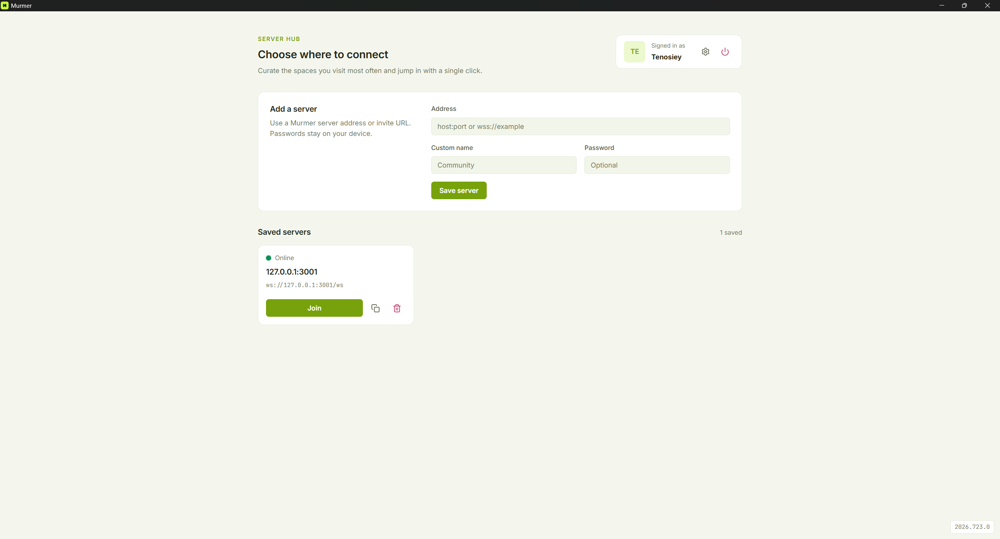
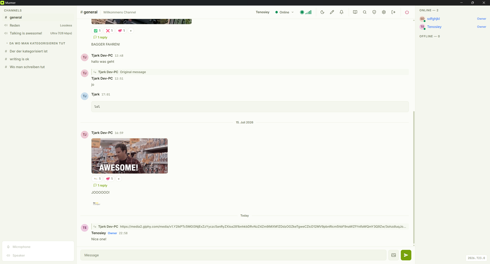
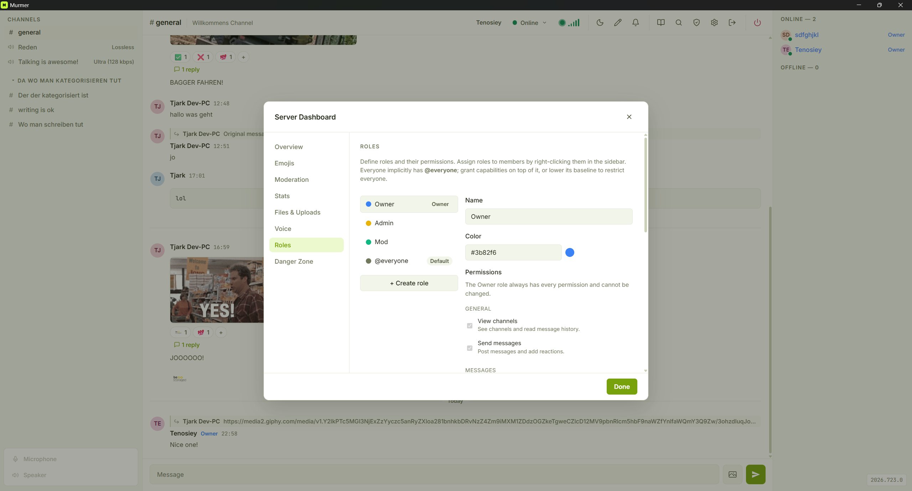

<p align="center">
  <picture>
    <source media="(prefers-color-scheme: dark)" srcset="murmer_client/static/logo/murmer-dark.svg">
    
  </picture>
</p>

<h1 align="center">Murmer</h1>

Murmer is a self-hostable voice and text chat prototype. The project is split
into a Rust WebSocket server and a cross-platform desktop client powered by
Tauri and SvelteKit. Both halves are designed with security-first defaults so a
small team can deploy a private chat space quickly.

## Screenshots

<p align="center">
  
</p>
<p align="center"><em>Server selection — pick or add a server to connect to.</em></p>

<p align="center">
  
</p>
<p align="center"><em>A text channel with the channel sidebar, message history and member list.</em></p>

<p align="center">
  
</p>
<p align="center"><em>The settings menu.</em></p>

## Features

- Persistent text chat stored in an embedded SQLite database
- WebRTC voice rooms with presence tracking. Opus runs with DTX and in-band
  FEC: a silent or muted participant costs a fraction of the packets an open
  microphone does — which adds up, since every client holds a connection to
  every other — and a single lost packet is reconstructed rather than concealed
- Ed25519 signature authentication with nonce-based replay protection
- Identity backup and restore (Settings → Identity): your key is your account
  on every server and the only thing that can read the direct messages sent to
  you, so it can be saved as a passphrase-encrypted recovery file or written
  down as a 24-word recovery phrase, and restored on another machine
- Rate limiting on authentication and chat events
- Markdown rendering with DOMPurify sanitisation and syntax highlighting
- Custom roles with granular per-permission control and colour accents, managed from the Server Dashboard
- Private text and voice channels with per-channel View / Write-Talk overrides for roles and members
- Secure file and image sharing (extension safe-list, content-type checks, size limits and path sanitisation)
- Desktop client with auto-reconnect and connection quality indicators
- Connection stats panel (server ping, voice RTT, jitter, packet loss); Owners
  and Admins can additionally view every user's self-reported stats (quality
  numbers only — no IPs or device details, kept in memory and dropped on
  disconnect)
- Slash commands (`/help`, `/me`, `/shrug`, `/topic`, `/status`,
  `/ephemeral`, `/search`)
- Link previews with server-side OpenGraph fetching (client IPs stay hidden from linked sites)
- Configurable input volume, noise suppression, echo cancellation and automatic
  gain control, with a live input level meter and a record-and-play-back
  microphone test
- RNNoise noise suppression (the default): a neural filter running locally in an
  audio worklet that removes keyboards, fans and background voices the platform's
  own suppressor leaves in. Selectable per user against the built-in suppressor
  or none at all, and comparable with the microphone test
- Independent playback volumes for voices, the app's own join/leave/mute blips,
  screen share audio and the soundboard, so turning one down leaves the rest
  where they were
- Voice activation with automatic sensitivity: the client tracks the background
  noise level and keeps the threshold just above it, with a manual slider for
  the cases it gets wrong
- Customizable hotkeys (mute, deafen, join/leave voice, search, settings, help)
  under Settings → Hotkeys; the voice hotkeys also work system-wide while the
  app is in the background (can be disabled)
- Ephemeral messaging, search across messages and wiki pages, server-synced
  pinned messages and message editing
- Message replies with quoted previews and lightweight threads
- Typing indicators and per-channel unread badges with new-message markers
- Moderation tools: role-gated kick, ban and timed mutes
- End-to-end encrypted direct messages with persistent history and unread
  badges: message text is encrypted on-device (NaCl box over the users'
  identity keys), so the server only ever stores and relays ciphertext
- End-to-end encrypted private channels: a private text channel can be switched
  to E2EE, after which every message is sealed under a shared channel key that
  only members hold, and the server keeps ciphertext alone
- Screen sharing in voice channels with adjustable resolution, frame rate and
  bitrate; Owners/Admins can set a server-wide bitrate cap from the dashboard.
  The sharer gets a floating self-preview to check what is actually being sent,
  which can be hidden (it costs CPU/GPU to render) and stays hidden until
  turned back on. System audio can be shared along with the picture (a checkbox
  in the OS picker); viewers get their own volume slider and mute for it,
  separate from the voice volume. Everyone in a voice channel can share at
  once, and a viewer can watch any number of those shares at the same time:
  each share opens as its own window floating over the app — move it, resize it
  from any corner, shrink it into a corner as picture-in-picture, maximize it or
  go fullscreen, with its own volume and mute. Nothing is blocked while a share
  is on screen, so chatting on keeps working next to it; "Tile" arranges every
  open window into a grid, and each window's position and size are remembered
  per person
- Soundboard: a shared library of short clips anyone in a voice channel can
  play for everyone present. Uploading is gated by *Manage sounds*, playing by
  *Use soundboard*, and a server-side cooldown keeps it from becoming a spam
  toy. Each listener gets their own master volume, per-sound volume/mute and a
  per-person "mute their sounds" switch — sounds play locally on every client
  rather than through the speaker's microphone
- Per-channel Markdown wiki with revisions and `[[wikilinks]]` (also across
  channels via `[[channel/page]]`); wiki pages are full-text indexed and show
  up in the search overlay alongside the message hits. Every page keeps a
  revision history: compare any two versions line by line and restore an
  older one — restoring appends a new revision rather than rewinding, so it
  is itself undoable
- Lifetime stats and achievements (messages, voice minutes, GIFs, favorite
  reactions and more) with double opt-in privacy: nothing is recorded unless
  a server Owner/Admin enables tracking server-wide *and* the user opts in
  themselves; only aggregate counters are stored and users can purge their
  own stats at any time
- User profiles: click a member (or their avatar/name on a message) to see
  their avatar, display name, roles, member since and "about" text; your own
  profile is the editor for all three. Avatars are uploaded per server and
  shown in messages, the member list and direct messages
- Server identity configurable from the dashboard (Admin/Owner): server name,
  description and icon shown to every member, plus a welcome message delivered
  to first-time members
- Server Dashboard beyond identity: a chat policy (slow mode, message length
  cap, profanity filter), the ban list, the upload policy with a storage-usage
  breakdown, voice defaults for new channels, the screen-share bitrate cap,
  who is online right now, and a Danger Zone that purges all messages or
  resets the server's structure
- REST API for bots (see [`murmer_server/BOT_API.md`](murmer_server/BOT_API.md))

## Repository layout

```
murmer_client/   Tauri + SvelteKit desktop client (TypeScript)
murmer_server/   Axum-based WebSocket server (Rust)
docker-compose.yml   boots the server (database is embedded)
```

Key documentation for contributors:

- `AGENTS.md` – repository overview and shared conventions
- `murmer_client/AGENTS.md` – client-specific tips
- `murmer_server/AGENTS.md` – server-specific tips
- `murmer_server/BOT_API.md` – REST API reference for bots
- `CONTRIBUTING.md` – code style and PR guidelines
- `docs/turn-support.md` – design note on TURN/relay support (not implemented)

## Brand

The logo is an "M" cut as negative space out of a rounded tile. It ships in two
variants that follow the app's theme: a lime tile with a dark mark for dark
mode, and a near-white tile with a green mark for light mode.

| | Tile | Mark |
| --- | --- | --- |
| Dark | `#c8ff3e` | `#141a05` |
| Light | `#f7faee` | `#84b800` |

Both variants sit on the same hue, which is also the app's default theme color —
picking any other color on the theme wheel re-tints the UI but never the logo.

Where the assets live:

- `murmer_client/static/logo/murmer-{dark,light}.svg` – favicon and README
- `murmer_client/src/lib/components/MurmerLogo.svelte` – in-app logo; reads the
  `--color-brand-*` tokens, so it switches with the theme on its own
- `murmer_client/src-tauri/icons/` – installer, window and tray icons

The window/installer icons are generated from the SVG rather than hand-edited.
After changing the artwork, regenerate them from `murmer_client/`:

```bash
npx tauri icon static/logo/murmer-dark.svg -o src-tauri/icons
```

That command also emits `android/`, `ios/` and `64x64.png`, which this
desktop-only project does not bundle — delete them again. The tray PNGs
(`icons/tray-{dark,light}.png`) are separate; regenerate each with
`npx tauri icon static/logo/murmer-<variant>.svg -o <tmp> -p 64`.

## Requirements

- [Rust](https://www.rust-lang.org/tools/install) (managed automatically via
  `rust-toolchain.toml`)
- [Bun](https://bun.sh) 1.x
- Docker and Docker Compose (for container-based workflows)

## Quick start (Docker)

1. Install Docker and Docker Compose.
2. Copy `.env.example` to `.env` and update values as needed.
3. From the repository root run:

```bash
docker compose up --build
```

4. The server listens on `http://localhost:3001` (WebSocket at `/ws`).
5. Launch the client locally:

```bash
cd murmer_client
bun install
bun run tauri dev
```

The desktop shell opens with a development build of the Svelte UI. Added servers
are stored locally by the client so your favourite instances remain available
after restarts.

## Local development

### Client

```bash
cd murmer_client
bun install          # install dependencies / refresh bun.lock
bun run dev          # hot module reloading for the Svelte UI
bun run tauri dev    # launch the native shell
bun run check        # TypeScript + Svelte diagnostics
bun run test         # Vitest unit tests (bun run test:watch to iterate)
```

### Server

```bash
cd murmer_server
cargo check          # compile-time checks
cargo fmt            # format Rust code
cargo clippy -- -D warnings
```

## Quality checks

`.github/workflows/ci.yml` runs these on every push to `main`/`dev` and on
every pull request (two parallel jobs, client and server). `cargo audit` and
`bun audit` are not part of it — run them locally. Run the rest before pushing
so you find breakage before CI does:

```bash
cd murmer_server
cargo fmt --check
cargo clippy --all-targets -- -D warnings
cargo test
cargo audit          # requires cargo-audit (cargo install cargo-audit)

cd ../murmer_client
bun run check
bun run test
bun audit
```

Client unit tests use [Vitest](https://vitest.dev) and live next to the module
they cover (`src/lib/**/*.test.ts`); shared harness code is in `test/`. They
target logic that is easy to get subtly wrong and hard to spot by clicking
around — the per-server namespacing of unread state, the wiki store's
request/response correlation, the wiki line diff — not UI rendering. `vitest.config.ts` runs them
in a plain Node environment and stubs the two framework pieces the stores
touch: the `$app/environment` browser flag and `localStorage`.

## Configuration

Environment variables recognised by the server:

| Variable | Required | Description |
|----------|----------|-------------|
| `DATABASE_PATH` | No | Path to the SQLite database file (defaults to `murmer.db`) |
| `UPLOAD_DIR` | No | Directory for stored uploads (defaults to `uploads/`) |
| `SERVER_PASSWORD` | No | Shared secret required during presence/auth |
| `ADMIN_TOKEN` | No | Enables the administrative `/role` endpoint |
| `BIND_ADDRESS` | No | Override the socket address (defaults to `0.0.0.0:3001`) |
| `CORS_ALLOW_ORIGINS` | No | Comma-separated allowed origins (omit in production) |
| `MAX_MESSAGES_PER_MINUTE` | No | Per-user message rate limit (default: 30) |
| `MAX_AUTH_ATTEMPTS_PER_MINUTE` | No | Per-IP auth rate limit (default: 5) |
| `MAX_UPLOADS_PER_MINUTE` | No | Per-IP file upload rate limit (default: 20) |
| `NONCE_EXPIRY_SECONDS` | No | Replay protection window (default: 300) |

Without `ADMIN_TOKEN` configured, channel and wiki management stay open to
everyone so a small unadministered server remains usable; every other
capability is still gated by roles.

## Profiles and display names

Every member has a profile, opened by clicking them in the member list, their
avatar or name on a message, or **View Profile** in the user context menu. It
shows the avatar, display name, account name, roles, the date they joined and
their "about" text. Opening your own profile (via your name in the header)
turns it into the editor for your avatar, display name and about text.

The **account name is not editable**: it is bound to your public key on first
connect and is what the server addresses everywhere — authentication, role
assignment, moderation, direct messages and message authorship. The display
name is a per-server label the UI shows in its place, so it may be empty (the
account name is used then) and may collide with someone else's. Every profile
shows the account name underneath the display name, which is how you tell two
members with the same display name apart.

## Roles and permissions

Authorization is permission-based. A **role** is a named, colored bundle of
permission toggles (view channels, send messages, use soundboard, manage
channels, kick, ban, manage roles, manage sounds, manage server, …) with a
hierarchy position. Every user
implicitly has the built-in **@everyone** role; any additional roles they hold
stack, and their effective permissions are the union. The built-in **Owner**
role is an administrator (all permissions) and sits at the top; **Admin** and
**Mod** are seeded as convenient starting points and can be edited or deleted.

Server owners create custom roles and tune each permission from the **Roles**
tab of the Server Dashboard. A role can also carry an **icon** — a custom
server emoji or an uploaded image (up to 512 KB) — which is shown next to the
name of every member holding it, in the member list, the voice channel list and
on their messages. Members display the icon of the highest role they hold that
has one. Because server-wide roles only *grant*, restrict a
capability by lowering the **@everyone** baseline and granting it through a
role — e.g. turn **Send messages** off for @everyone and give a "Member" role
that has it, so anyone with only a view-only role cannot post.

### Private channels

Text and voice channels can be made **private** so only chosen roles and members
can see or use them. Managers (anyone with **Manage channels**) create a private
channel from the sidebar's "Create" menu, or open **Edit Permissions** on any
channel to configure per-channel overrides.

Each override is a tri-state (**allow / inherit / deny**) for two permissions:
**View** (see the channel; for voice, see + join + listen) and **Write/Talk**
(post messages; for voice, speak). A channel is private when **View** is denied
for `@everyone`; grant it back to specific roles or members. Denying only
Write/Talk to a role or member makes them read-only (or listen-only in voice).

The server hides private channels from users who cannot see them and enforces
View and text Write server-side. Voice **talk** is enforced by the client
(the microphone is disabled for listen-only members); because voice audio is
peer-to-peer, a modified client could bypass the mute, so treat View/join as the
real boundary.

#### End-to-end encryption

A private **text** channel can additionally be switched to **end-to-end
encrypted** in the same Edit Permissions dialog. From then on the server stores
and relays ciphertext only: it keeps who posted, when, and how long the message
was — never what it said.

How it works: the channel has one symmetric key, generated on a member's
machine. Each member gets their own copy of it, sealed to the X25519 key derived
from their Ed25519 identity — the same key pair that encrypts DMs — so the
server stores one opaque blob per member and can open none of them. Keys are
versioned by an **epoch**: adding a member hands them the current key, removing
one starts a fresh epoch that is never wrapped for them. Old epochs stay
available to the members who had them, so history keeps opening. Clients do all
of this themselves whenever they see the channel's membership change, so no
operator action is needed — but the key can only reach a new member while a
current member is online, which is why a fresh member sometimes sees "waiting
for this channel's key" for a while.

The trade-offs are real and worth knowing before switching it on:

- **Server-side search does not cover the channel**, because there is no text to
  index. The search overlay says so.
- **Bots cannot post there.** A bot has no identity key, so it is not on the key
  roster and has nothing to encrypt with.
- **Uploaded files are not encrypted.** Their bytes go through `/upload` as
  usual; only the attachment's name and URL travel sealed, so who shared what is
  hidden but the file itself is not.
- **Link previews, the profanity filter and content-derived stats stop.** All
  three are server-side and see nothing. Slow mode and the message length cap
  still apply.
- **The server is still the directory.** It decides who is on the member roster
  and hands out the identity keys the key is wrapped for, so a malicious server
  could put a key it controls on the roster. Clients pin every member's identity
  key on first sight and refuse to share the channel key with a key that changed
  — the same bound DMs have. The dialog shows the current key's fingerprint;
  two members reading the same groups aloud hold the same key.
- **No forward secrecy within an epoch.** Whoever holds an epoch's key reads
  everything sent under it, permanently.
- Turning encryption back off does not decrypt what is already stored — those
  messages stay unreadable, and their key material is dropped.

### Bootstrapping the Owner from Docker

The first Owner must be assigned from the server terminal because no one has
permission to grant roles yet. Run the CLI subcommand inside the Docker
container:

```bash
docker exec <server-container> murmer_server set-role <public_key> Owner
```

Replace `<public_key>` with the user's Ed25519 public key (shown in the client
settings) and `<server-container>` with the container name (e.g.
`murmer-server-1`). You can also pass an optional hex colour as a third
argument. The command adds the named role, creating it if it does not exist.

### Managing roles from the client

Users with the **Manage roles** permission define roles in the Server Dashboard
(Roles tab) and assign them by right-clicking a member in the sidebar user list
and toggling roles in the **Roles** submenu. You can only manage roles and
members positioned below your own highest role, and can never grant a
permission you do not hold yourself. Changes take effect immediately for all
connected clients.

### Using the HTTP endpoint

The `POST /role` endpoint (guarded by `ADMIN_TOKEN`) still works for scripted or
external integrations. See the configuration table above for details.

## Server Dashboard

Everything server-wide lives in the Server Dashboard (the server name in the
sidebar header). Each tab is gated by the permission it controls, and every
setting is re-checked and enforced server-side — the UI only decides what to
show.

| Tab | Permission | What it holds |
| --- | --- | --- |
| Overview | Manage server | Server name, description, welcome message and icon, plus who is online right now |
| Emojis | Manage emojis | The server's custom emoji library |
| Moderation | Ban members | The ban list (lift a ban from here); with Manage server also slow mode, the message length cap and the profanity filter |
| Stats | Manage server | The server-wide half of the double opt-in stat tracking |
| Files & Uploads | Manage server | Per-file size cap, which file categories are accepted, and how much disk the uploads directory is using per category |
| Voice | Manage server | Quality preset and bitrate new voice channels start with |
| Screen Share | Manage server | The server-wide outgoing bitrate cap |
| Roles | Manage roles | Role definitions, permissions, colours, icons and hierarchy |
| Danger Zone | Administrator | Purge all messages, or reset the server's structure |

A few details worth knowing before you use them:

- **Slow mode** makes each member wait between messages. Members who can
  manage messages are exempt, so moderators can still answer a busy room.
- **Max message length** can only lower the built-in 4000-character limit.
- **The profanity filter** replaces listed words with asterisks on the server,
  before a message is stored or broadcast, and applies to edits too. Matching
  is per whole word and case-insensitive, so filtering `ass` leaves `class`
  alone.
- **Voice defaults** apply to newly created voice channels; existing channels
  keep whatever they were created with.
- **Storage used** is measured when the tab is opened rather than counted as
  files arrive, so it covers uploads, emojis, avatars and soundboard clips
  alike. Deleting a message or an emoji does not delete its file.
- **Purge all messages** deletes every message, pin and reaction on the server
  for everyone; the uploaded files behind attachments stay on disk.
- **Reset server** additionally deletes every channel except `general`, all
  categories, channel permission overrides, wiki pages and every role other
  than `@everyone` and `Owner` — those two stay so the server still has an
  administrator. Members, bans, emojis, sounds and recorded stats are kept.

Both Danger Zone actions are irreversible and ask you to type a confirmation
phrase, which the server requires in the request as well.

### Releasing a claimed user name

A user name is permanently bound to the first Ed25519 key that authenticates
with it, so nobody can impersonate an offline user. If someone loses their
keypair (e.g. after a reinstall), release the name so their new key can claim
it:

```bash
docker exec <server-container> murmer_server unbind-name <user_name>
```

## Windows build instructions

1. Install the [Tauri prerequisites](https://v2.tauri.app/start/prerequisites/)
   for Windows (Visual Studio Build Tools, WebView2, etc.).
2. Install [Rust](https://www.rust-lang.org/tools/install) and
   [Bun 1.x](https://bun.sh) and ensure both are available in `PATH`.
3. Build the client from `murmer_client/`:

```bash
bun install
bun run build
bun run tauri build
```

Bundles are produced in `murmer_client/src-tauri/target/release/bundle`.

Note: because the app ships auto-updates (see below), `bun run tauri build`
signs the updater artifacts and therefore needs the signing key in the
environment:

```powershell
$env:TAURI_SIGNING_PRIVATE_KEY = Get-Content "$env:USERPROFILE\.tauri\murmer.key" -Raw
$env:TAURI_SIGNING_PRIVATE_KEY_PASSWORD = "<password>"
```

4. (Optional) Produce an optimised server binary:

```bash
cd ../murmer_server
cargo build --release
```

## Releases and auto-updates

The desktop client updates itself via the Tauri updater: **Settings → Updates →
Check for Updates** downloads and installs the latest GitHub release without a
manual download. This requires every release to ship signed updater artifacts
and a `latest.json`, which the `Release` GitHub Actions workflow
([`.github/workflows/release.yml`](.github/workflows/release.yml)) produces
automatically.

One-time setup (already done for this repository once the secrets exist):

1. Generate the updater signing keypair:

   ```bash
   cd murmer_client
   bun run tauri signer generate -- -w ~/.tauri/murmer.key
   ```

   Keep the private key safe — if it is lost, existing installs can no longer
   receive updates and users must reinstall manually.
2. Put the public key into `plugins.updater.pubkey` in
   `murmer_client/src-tauri/tauri.conf.json`.
3. Add the repository secrets `TAURI_SIGNING_PRIVATE_KEY` (contents of the key
   file) and `TAURI_SIGNING_PRIVATE_KEY_PASSWORD` (the password chosen during
   generation) under GitHub → Settings → Secrets → Actions.

Publishing a release:

1. Bump the version:

   ```bash
   cd murmer_client
   bun run bump
   ```

   Versions follow the date-based scheme `YYYY.MDD.N` (year, month+day,
   counter for multiple releases on the same day), e.g. `2026.710.0` for the
   first release on 2026-07-10. Client and server share one version: the
   script writes it into the client's `package.json`,
   `src-tauri/tauri.conf.json`, `src-tauri/Cargo.toml` and
   `src-tauri/Cargo.lock` as well as the server's `Cargo.toml` and
   `Cargo.lock` — do not bump the server separately.
   The scheme stays semver-ordered — required, because installed clients only
   offer an update when the new version compares greater than theirs.
2. Commit, tag and push:

   ```bash
   git commit -am "Release v<version>"
   git tag v<version>
   git push origin v<version>
   ```

The workflow builds the NSIS installer, signs the updater artifacts and
publishes everything as a regular (non-prerelease) GitHub release. Releases
must not be marked as pre-release — the updater endpoint
`releases/latest/download/latest.json` ignores prereleases.

## Security highlights

- Authentication uses Ed25519 signatures; timestamps are validated and bound to
  per-user nonces. A claimed public key is always verified — also on servers
  without a password — so roles and moderation identity cannot be spoofed.
- A user name stays permanently bound to the public key that first used it
  (persisted in the database), so another client cannot take over an offline
  user's name and inherit their role. The `unbind-name` CLI subcommand
  releases a name when a user loses their keypair.
- Direct messages are end-to-end encrypted: both sides derive X25519 keys from
  their Ed25519 identity keys and encrypt with NaCl box, so the server never
  sees DM plaintext (metadata — sender, recipient, timestamps — remains
  visible for routing). Clients pin a peer's key on first contact, warn and
  block sending when it changes, and offer a fingerprint for out-of-band
  verification. Note the trade-offs: there is no forward secrecy (a stolen
  keypair decrypts past DMs), a lost keypair makes old conversations
  unreadable, and users without a key binding (e.g. bots) cannot receive DMs.
- Private text channels can be end-to-end encrypted: a symmetric channel key,
  generated client-side and wrapped per member with the same identity keys DMs
  use, seals every message before it reaches the server. Removing a member
  rotates the key to a new epoch they are never given, so the removal is
  cryptographic rather than cosmetic. See [Private channels](#private-channels)
  for the trade-offs — no server-side search, unencrypted upload payloads, no
  bot posting and no forward secrecy within an epoch.
- IP-based rate limiting protects authentication, chat message throughput and
  file uploads. On top of it, **Server Dashboard → Moderation** adds a per-user
  slow mode, a message length cap and a profanity filter. All three are
  enforced server-side: the filter masks matched words before a message is
  stored or broadcast (edits included), so the original never reaches another
  client, and the length cap can only narrow the built-in 4000-character limit.
- Uploading requires the same Ed25519 proof as connecting: the `/upload`
  endpoint accepts only a freshly signed, single-use timestamp from a key that
  already has an account on that server, so a stranger who can merely reach the
  port cannot write files to the operator's disk (and on a password-protected
  server has no account to upload under at all).
- Filenames are sanitised, uploads are limited to a safe-list of extensions and image contents are inspected before saving. Owners narrow that further in **Server Dashboard → Files & Uploads** (per-file size cap, plus which of the image/document/archive/audio/video categories are accepted); active content such as HTML, SVG or scripts is never on the safe-list and cannot be enabled.
- Admin token and server password checks use constant-time comparisons to
  mitigate timing attacks.
- Every capability is gated by a server-side permission check against the
  user's roles; client-side gating is only cosmetic.

## Third-party components

Most dependencies are pulled in as source, but the client ships one prebuilt
binary in its installer and it is worth naming:

- Noise suppression is [RNNoise](https://github.com/xiph/rnnoise) (Xiph.Org,
  BSD-3-Clause), as the WebAssembly build from
  [shiguredo/rnnoise-wasm](https://github.com/shiguredo/rnnoise-wasm)
  (Apache-2.0), wrapped by
  [@sapphi-red/web-noise-suppressor](https://github.com/sapphi-red/web-noise-suppressor)
  (MIT) for the audio-worklet plumbing.

## Contributing

See [`CONTRIBUTING.md`](CONTRIBUTING.md) for detailed guidelines.
