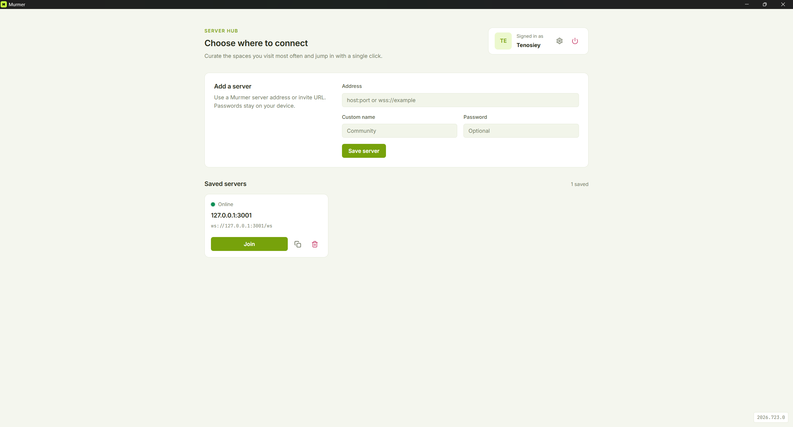
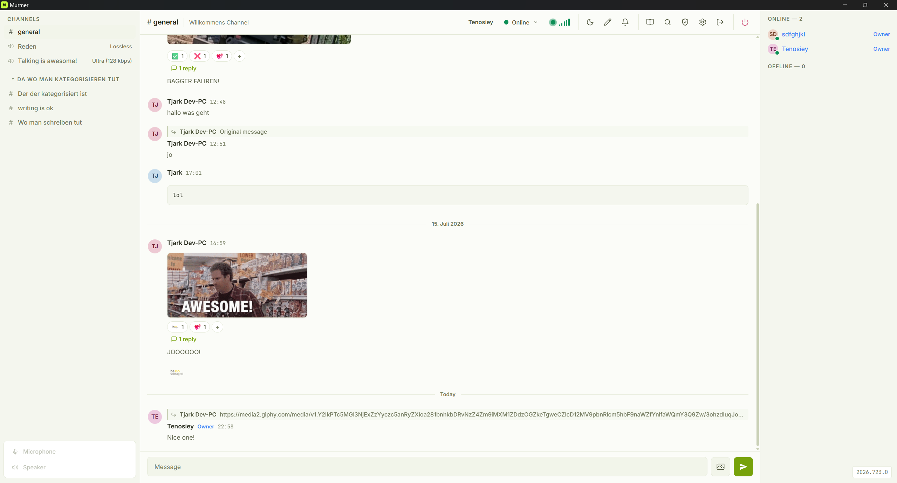
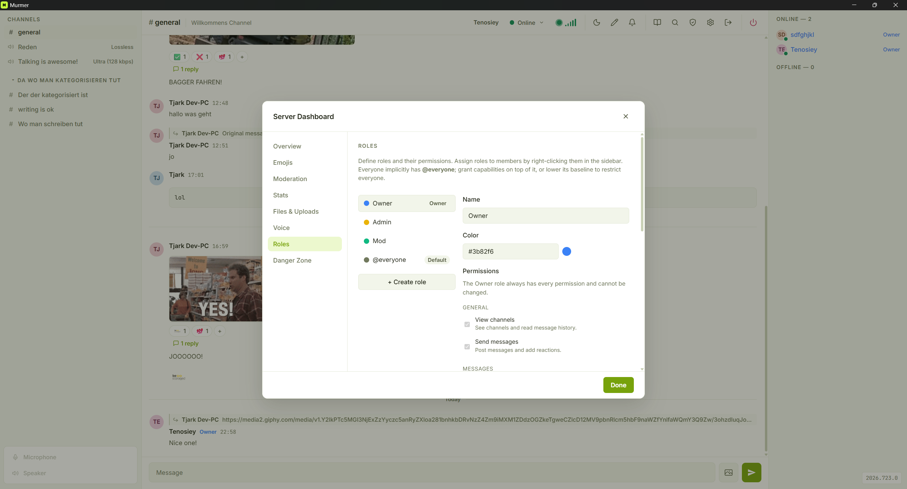

<p align="center">
  <picture>
    <source media="(prefers-color-scheme: dark)" srcset="murmer_client/static/logo/murmer-dark.svg">
    
  </picture>
</p>

<h1 align="center">Murmer</h1>

Murmer is a self-hostable voice and text chat for small groups: a Rust
WebSocket server with an embedded SQLite database, and one SvelteKit client
that runs both as a Tauri desktop app and, unchanged, in the browser.

<p align="center">
  
</p>
<p align="center"><em>Server selection — pick or add a server to connect to.</em></p>

<p align="center">
  
</p>
<p align="center"><em>A text channel with the channel sidebar, message history and member list.</em></p>

<p align="center">
  
</p>
<p align="center"><em>The settings menu.</em></p>

## Features

- **Text chat** with Markdown, replies and threads, edits, pins, reactions,
  forwarding, `@` mentions with a mentions inbox, search with `from:`,
  `in:`, `has:file` and date filters, link previews, file and image
  sharing, slash commands, `/tts`, reminders and scheduled messages
- **Voice** over peer-to-peer WebRTC with RNNoise noise suppression,
  voice activation or push-to-talk, camera video, screen sharing (several
  at once, each in its own window), breakout rooms and a soundboard
- **End-to-end encryption** for direct messages and, optionally, for private
  text channels: the server only ever stores ciphertext there
- **Roles and permissions** with private channels, per-channel overrides,
  nicknames, moderation (kick, ban, timed mutes, slow mode, profanity filter,
  auto-moderation rules) and an audit log, all managed from the Server
  Dashboard
- **Per-channel wikis** with revision history and `[[wikilinks]]`
- **Accounts are keys**: Ed25519 identities instead of passwords, with a
  recovery file or 24-word phrase to move them to another machine
- **Invite links** that open the web client or paste into the desktop app
- **A REST API for bots** — [`murmer_server/BOT_API.md`](murmer_server/BOT_API.md)

Opt-in lifetime stats and achievements, user profiles, customizable hotkeys
and per-source volume controls round it out.

## Quick start

You need Docker, [Rust](https://www.rust-lang.org/tools/install) (the
toolchain is pinned by `rust-toolchain.toml`) and [Bun](https://bun.sh) 1.x.

```bash
cp .env.example .env        # adjust as needed
docker compose up --build   # server on http://localhost:3001, WebSocket at /ws
```

```bash
cd murmer_client
bun install
bun run tauri dev           # desktop app with a development build of the UI
```

Add `localhost:3001` as a server in the app and you are in.

## Configuration

Environment variables recognised by the server:

| Variable | Required | Description |
|----------|----------|-------------|
| `DATABASE_PATH` | No | Path to the SQLite database file (defaults to `murmer.db`) |
| `UPLOAD_DIR` | No | Directory for stored uploads (defaults to `uploads/`) |
| `SERVER_PASSWORD` | No | Shared secret required during presence/auth |
| `ADMIN_TOKEN` | No | Enables the administrative `/role` endpoint |
| `BIND_ADDRESS` | No | Override the socket address (defaults to `0.0.0.0:3001`) |
| `CORS_ALLOW_ORIGINS` | No | Comma-separated allowed origins (omit in production) |
| `WEB_CLIENT_DIR` | No | Directory with the built web client to serve at `/` (see [Web client](#web-client)) |
| `MAX_MESSAGES_PER_MINUTE` | No | Per-user message rate limit (default: 30) |
| `MAX_AUTH_ATTEMPTS_PER_MINUTE` | No | Per-IP auth rate limit (default: 5) |
| `MAX_UPLOADS_PER_MINUTE` | No | Per-IP file upload rate limit (default: 20) |
| `TRUSTED_PROXIES` | Behind a reverse proxy | Comma-separated addresses or CIDR ranges of your reverse proxies (e.g. `127.0.0.1` or `172.16.0.0/12` for Docker). Only requests from these may set the client IP through `X-Forwarded-For`; without it every user behind the proxy shares one per-IP rate limit, so a few failed logins lock everyone out |
| `MAX_FRAMES_PER_SECOND` | No | Sustained WebSocket frames one connection may send per second, with ten seconds' worth allowed in a burst (default: 20, `0` for no limit) |
| `STUN_SERVERS` | No | Comma-separated `stun:`/`stuns:` URLs clients use to set up voice and screen share (defaults to `stun:stun.l.google.com:19302`; set it empty to contact no STUN server, which limits calls to peers on the same network) |
| `MAX_VOICE_CHANNEL_USERS` | No | People allowed in one voice channel (default: 10, `0` for no limit) |
| `MESSAGE_RETENTION_DAYS` | No | Delete channel messages, with their reactions and pins, once they are this many days old; checked hourly. DMs are kept. Unset or `0` keeps everything |

Every capability, channel and wiki management included, is gated by roles
whether or not `ADMIN_TOKEN` is set, so a new server needs its first Owner
assigned (below) before anyone can create channels.

## Running a server

**Without a checkout**, every release also publishes the server as an image,
tagged with its version and `latest`:

```bash
docker pull ghcr.io/tenosiey/murmer-server:latest
```

In `docker-compose.yml`, swap `build:` for the commented `image:` line to use
it. Pin a version tag rather than `latest` to upgrade on your own schedule;
the server's version should match the desktop app's.

**The first Owner** has to be assigned from the server, because nobody can
grant roles yet. Copy your public key from the client settings, then:

```bash
docker exec <server-container> murmer_server set-role <public_key> Owner
```

The role is created if it does not exist; an optional hex colour can follow
as a third argument. From then on, roles are managed in the client's Server
Dashboard. With `ADMIN_TOKEN` set, `POST /role` does the same over HTTP for
scripts.

**A lost key** cannot reclaim its name: a name binds permanently to the first
key that uses it, so nobody can impersonate an offline user. Release it so the
new key can claim it:

```bash
docker exec <server-container> murmer_server unbind-name <user_name>
```

**Invites.** Hand out invite codes minted in Server Dashboard → **Invites**:
they carry a lifetime and a use limit and can be revoked without changing
`SERVER_PASSWORD`. Revoking stops future joins; someone who already joined is
removed with a ban. The hub's **Copy invite link** instead embeds the saved
password and stays valid until the password changes. Either way the details
sit in the URL fragment, which never reaches a web server's logs — but the
link is still a credential.

**Encrypted channels** are a per-channel choice with real trade-offs: no
server-side search, no bot posting, no forwarding, link previews or
moderation filters, and uploaded file bytes stay unencrypted. The full list
is in [`docs/security.md`](docs/security.md#what-encryption-does-not-cover).

## Web client

The same build runs in a browser. Everything works except OS-wide hotkeys
and the built-in updater. The simplest deployment is to let the Murmer server
host it:

```bash
cd murmer_client && bun install && bun run build      # writes build/
WEB_CLIENT_DIR=/path/to/murmer_client/build murmer_server
```

Served that way it shares an origin with `/ws`, so CORS stays off, and every
page carries the desktop app's Content-Security-Policy. Any other static host
works too, as long as it:

- serves **HTTPS** — browsers only allow microphone and screen capture in a
  secure context, and an HTTPS page can only reach `wss://` servers;
- answers unknown paths with `build/200.html` (nginx:
  `try_files $uri $uri.html /200.html;`), so deep links like `/invite#…`
  resolve;
- is named in `CORS_ALLOW_ORIGINS` on every Murmer server it talks to.

## Building the desktop app

Install the [Tauri prerequisites](https://v2.tauri.app/start/prerequisites/),
then from `murmer_client/`:

```bash
bun run build && bun run tauri build    # bundles land in src-tauri/target/release/bundle
```

The build signs the updater artifacts, so it needs `TAURI_SIGNING_PRIVATE_KEY`
and `TAURI_SIGNING_PRIVATE_KEY_PASSWORD` in the environment. Installed apps
update themselves from GitHub releases (Settings → Updates); how a release is
cut is [`agents/skills/releasing.md`](agents/skills/releasing.md).

## Security

Authentication is an Ed25519 signature over a per-connection server
challenge, uploads ride on that connection, every permission is checked
server-side, and DMs and encrypted channels are opaque to the server. What
that does and does not protect against is [`docs/security.md`](docs/security.md).

Please report security problems by email to the maintainer, not as a public
issue. Everything else goes to <https://github.com/Tenosiey/Murmer/issues>.

## Third-party components

Noise suppression is [RNNoise](https://github.com/xiph/rnnoise) (Xiph.Org,
BSD-3-Clause), shipped as the WebAssembly build from
[shiguredo/rnnoise-wasm](https://github.com/shiguredo/rnnoise-wasm)
(Apache-2.0) and wrapped by
[@sapphi-red/web-noise-suppressor](https://github.com/sapphi-red/web-noise-suppressor)
(MIT).

## Contributing

Start with [`CONTRIBUTING.md`](CONTRIBUTING.md).
